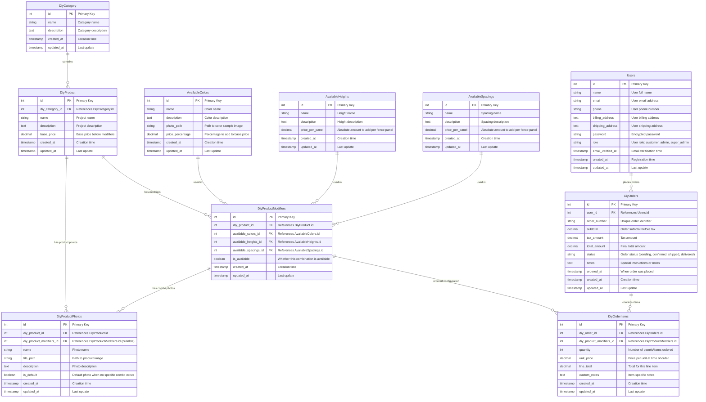

# DIY System Database Schema

**Laravel DIY Project Management System**

*Created: September 29, 2025*
*Starting with: DiyProduct table*

---

## Database Schema Design



---

## Current Schema

**DiyCategory** - Laravel model for project categories
- Table: `diy_categories`

**DiyProduct** - Laravel model for DIY projects
- Table: `diy_products`
- References DiyCategory via diy_category_id foreign key

**AvailableColors** - Laravel model for color options
- Table: `available_colors`

**AvailableHeights** - Laravel model for height options
- Table: `available_heights`

**AvailableSpacings** - Laravel model for spacing options
- Table: `available_spacings`


**DiyProductPhotos** - Laravel model for product images
- Table: `diy_product_photos`
- References DiyProduct for default photos
- References DiyProductModifiers for specific combination photos

**DiyProductModifiers** - Laravel model for product configuration combinations
- Table: `diy_product_modifiers`
- Links specific combinations of color + height + spacing to display photos
- References DiyProduct, AvailableColors, AvailableHeights, AvailableSpacings, and DiyPhotos

**Users** - Laravel model for user authentication and profiles
- Table: `users` (existing Laravel users table)
- Handles authentication, roles, and customer information
- Roles: `customer`, `admin`, `super_admin`

**DiyOrders** - Laravel model for order management
- Table: `diy_orders`
- References Users via user_id foreign key
- Tracks order status, totals, and timestamps

**DiyOrderItems** - Laravel model for order line items
- Table: `diy_order_items`
- References DiyOrders via diy_order_id foreign key
- References DiyProductModifiers via diy_product_modifiers_id foreign key
- Stores quantity, pricing, and item-specific notes

## Laravel Relationships
```php
// DiyCategory Model
public function diyProducts() {
    return $this->hasMany(DiyProduct::class);
}

// DiyProduct Model
public function diyCategory() {
    return $this->belongsTo(DiyCategory::class);
}

// AvailableColors Model
public function diyPhotos() {
    return $this->hasMany(DiyPhotos::class);
}

// DiyPhotos Model
public function availableColors() {
    return $this->belongsTo(AvailableColors::class);
}
```

## Photo Display Logic

**Smart Photo Selection**: Default → Specific Combination

```sql
-- Photo selection query for Mike's choices:
-- Product: Lakeland Fence, Color: White, Height: 6ft, Spacing: Standard

-- 1. Try to find exact combination photo
SELECT * FROM diy_photos
WHERE diy_product_id = [lakeland_fence_id]
  AND available_colors_id = [white_id]
  AND available_heights_id = [6ft_id]
  AND available_spacings_id = [standard_id]
LIMIT 1;

-- 2. If no exact match, try color + height
SELECT * FROM diy_photos
WHERE diy_product_id = [lakeland_fence_id]
  AND available_colors_id = [white_id]
  AND available_heights_id = [6ft_id]
  AND available_spacings_id IS NULL
LIMIT 1;

-- 3. If no match, try color only
SELECT * FROM diy_photos
WHERE diy_product_id = [lakeland_fence_id]
  AND available_colors_id = [white_id]
  AND available_heights_id IS NULL
  AND available_spacings_id IS NULL
LIMIT 1;

-- 4. If no match, use default product photo
SELECT * FROM diy_photos
WHERE diy_product_id = [lakeland_fence_id]
  AND is_default = true
LIMIT 1;
```

## Mike's Complete User Journey ✅

**Step 1**: Choose "Vinyl Fence" category
**Step 2**: Choose "Lakeland Fence" product (gets `base_price` + default product photo)
**Step 3**: Choose White color (shows **color swatch** from `AvailableColors.photo_path`)
**Step 4**: Choose 6ft height + Standard spacing
**Step 5**: System shows **modified product photo** (combination-specific or default)
**Step 6**: System calculates **exact price** (base + color% + height$ + spacing$)
**Step 7**: Mike adds to cart (quantity: 8 panels) - *requires login/registration*
**Step 8**: Mike proceeds to checkout (user already authenticated)
**Step 9**: System creates order with line items
**Step 10**: Mike receives order confirmation

**Result**: Mike has successfully ordered 8 White Lakeland fence panels at 6ft height!

## Complete Order Flow:
1. **Product Configuration**: `DiyProductModifiers` stores his exact choices
2. **Customer Info**: `Customers` stores Mike's contact and address
3. **Order Header**: `DiyOrders` tracks order totals and status
4. **Order Details**: `DiyOrderItems` stores what he ordered and pricing

## Two Photo Types:
- **Color Swatches**: `AvailableColors.photo_path` - Shows actual color samples
- **Product Photos**: `DiyProductPhotos` - Shows fence with modifications applied

---

## User Authentication & Role System 🔐

**Integration Strategy**: Use Laravel's existing `users` table + Spatie Permission package for roles.

### User Roles (Existing Spatie System):

**Current Roles:**
- `Human Resources` - HR permissions for careers/users
- `Sales` - Product/order management permissions
- `Webmaster` - Blog/content management permissions
- `SuperAdmin` - Full system access

**New DIY Role:**
1. **`Customer`** - New role for DIY customers
   - ✅ Browse DIY products and pricing
   - ✅ Add items to cart and place orders
   - ✅ View order history and account details
   - ❌ Access admin panels

**Integration with Existing:**
- **Sales Role** gets DIY management permissions
- **SuperAdmin** automatically gets all DIY permissions
- **Customer Role** is frontend-only (no admin access)

### Authentication Flow:

```php
// Guest browsing - no auth required
Route::get('/diy', [DiyController::class, 'index']); // ✅ Public

// Cart requires authentication
Route::middleware('auth')->group(function () {
    Route::post('/diy/cart/add', [CartController::class, 'add']);
    Route::get('/diy/checkout', [CheckoutController::class, 'show']);
    Route::post('/diy/orders', [OrderController::class, 'store']);
});

// Admin requires role
Route::middleware(['auth', 'role:Sales|SuperAdmin'])->group(function () {
    Route::resource('/admin/diy-products', DiyProductController::class);
});
```

### User Registration:
- **Default Role**: New registrations automatically get `Customer` role
- **Required Fields**: name, email, password, phone, billing_address
- **Optional Fields**: shipping_address (can default to billing)
- **Email Verification**: Required before placing orders

### Database Integration:
- **Leverage Existing**: Use current Laravel `users` table
- **Add Fields Needed**: phone, billing_address, shipping_address (via migration)
- **Role Management**: Existing Spatie Permission package
- **New Permissions**: Add DIY-specific permissions to Sales and SuperAdmin roles

---

## Price Isolation Strategy 🔒

**CRITICAL BUSINESS RULE**: Order totals must NEVER change after checkout completion.

### How Price Isolation Works:

1. **During Browsing**: Prices calculated dynamically from current modifier values
2. **At Checkout**: Calculated prices are "frozen" and stored in order tables
3. **After Order**: Changes to base prices/modifiers DO NOT affect existing orders

### Database Design for Price Isolation:

```php
// At checkout time - calculate and freeze prices
$calculatedPrice = $product->base_price
    + $height->price_per_panel
    + $spacing->price_per_panel;
$finalPrice = $calculatedPrice * (1 + $color->price_percentage);

// Store frozen price in order
DiyOrderItems::create([
    'unit_price' => $finalPrice,  // ✅ FROZEN - never changes
    'line_total' => $finalPrice * $quantity,  // ✅ FROZEN - never changes
    // ... other fields
]);
```

### What Gets Frozen in Orders:
- ✅ `DiyOrderItems.unit_price` - Exact price customer paid per panel
- ✅ `DiyOrderItems.line_total` - Total for that line item
- ✅ `DiyOrders.subtotal` - Order subtotal
- ✅ `DiyOrders.tax_amount` - Tax calculation
- ✅ `DiyOrders.total` - Final order total

### What Can Change Without Affecting Orders:
- ❌ `DiyProduct.base_price` - Future orders only
- ❌ `AvailableColor.price_percentage` - Future orders only
- ❌ `AvailableHeight.price_per_panel` - Future orders only
- ❌ `AvailableSpacing.price_per_panel` - Future orders only

**Result**: Mike's $1,718.64 order stays $1,718.64 forever, regardless of future price changes.

---

## Mike's Order Calculation Example

**Configuration**: White Lakeland Fence, 6ft height, Standard spacing
**Quantity**: 8 panels

```sql
-- Correct calculation order: Absolute amounts first, then percentage
Base Price: $150.00 per panel
Height (6ft): +$25.00 per panel
Spacing (Standard): +$5.00 per panel
Subtotal before color: $180.00 per panel
Color (White): +10% of subtotal = $18.00 per panel
Total per panel: $198.00

-- Order totals
Subtotal: 8 × $198.00 = $1,584.00
Tax (8.5%): $134.64
Final Total: $1,718.64
```

**Database Records Created:**
- `Customers`: Mike's contact info
- `DiyOrders`: Order #DF-2025-001, Total: $1,718.64, Status: "pending"
- `DiyOrderItems`: 8× White Lakeland 6ft panels @ $198.00 each

## Pricing Calculation Rules

**CRITICAL: Calculation Order**
1. **Base Price** from product
2. **Add Absolute Amounts** (heights, spacings, etc.)
3. **Apply Color Percentage** to total of (base + absolute amounts)
4. **Calculate Tax** on final subtotal

**Laravel Implementation Example:**
```php
$basePrice = $product->base_price; // $150.00
$heightCost = $height->price_per_panel; // $25.00
$spacingCost = $spacing->price_per_panel; // $5.00
$subtotalBeforeColor = $basePrice + $heightCost + $spacingCost; // $180.00
$colorMultiplier = $color->price_percentage / 100; // 0.10
$finalPrice = $subtotalBeforeColor * (1 + $colorMultiplier); // $198.00
```

*Schema now supports complete e-commerce functionality with correct pricing order!*